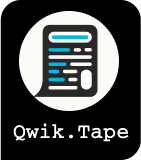
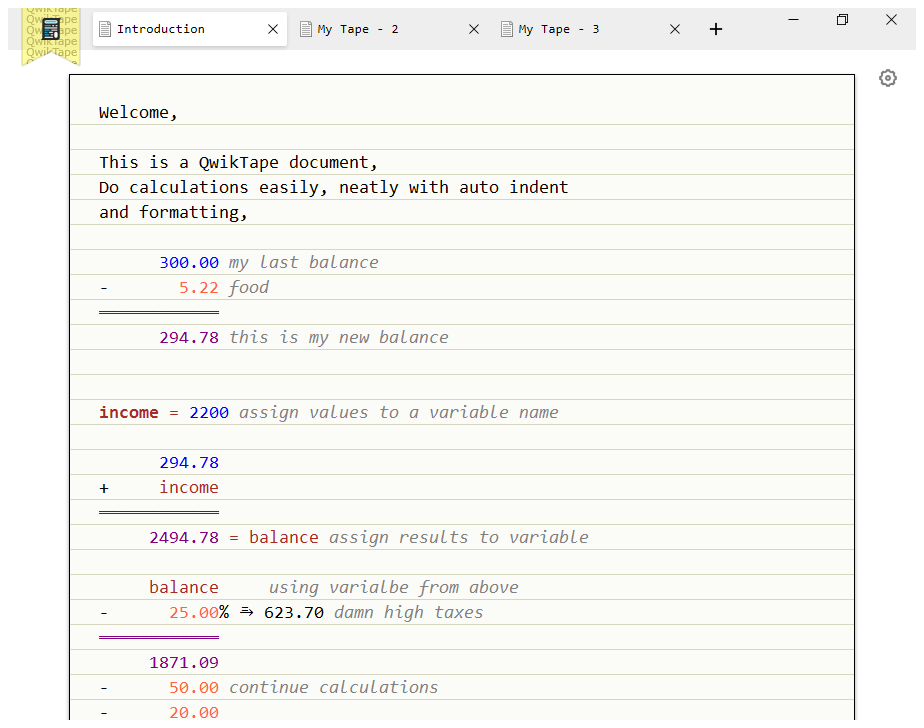

Do calculations, annotate it like you would on a paper "qwikly".



# Features
* Write text, calculations, and annotations with the same ease as you would on paper or in a book.
* Annotate your calculations to avoid forgetting what they were about.
* Perform calculations such as addition <kbd>+</kbd>, subtraction <kbd>-</kbd>, division <kbd>÷</kbd>, multiplication <kbd>×</kbd>, percentage <kbd>%</kbd>, and power <kbd>^</kbd>.
* Create unlimited tapes using `+` button in tabs bar, switch between tapes using browser like tabs.
* View/Rename/Delete your saved tapes in the Bookmark menu, use the top left menu to view all tapes.
* Tapes will auto save, allowing you to pick up right where you left off.
* The numbers will auto format and auto indented as you type.
* Numbers are formatted according to your locale.
* You can define variables and use it in calculations.
* Hover cursor over variables to check it's value.
* Customize colors using the settings menu , number of decimals to display and indent length can be changed too.
* Tape calculation doesn't use operator precedence, the results will be as you would type it on a calculator. 
```
       1.00
+      2.00
×      3.00
═══════════
       9.00
```
* Expressions use operator precedence. `myvar = 1 + 2 × 3` myvar is `7`.
* All calculations are performed with infinite precision, resulting in highly accurate and reliable results, so [`0.1 + 0.2 = 0.3`](https://0.30000000000000004.com/)
* Export your tape as PDF .

<br></br>
EITHER 

[Download QwikTape](https://github.com/4silvertooth/QwikTape/releases) from releases,

OR 
```bash
git clone --recurse-submodules https://github.com/4silvertooth/QwikTape.git
```
and run

[**`run-win.bat`**](run-win.bat) for windows
[**`sh run-linux.sh`**](run-linux.sh) for linux
[**`sh run-macosx.sh`**](run-macosx.sh) for macosx


# What's in a name?
QwikTape the name is inspired by [QuickJs](https://github.com/bellard/quickjs) used by [Sciter](https://gitlab.com/sciter-engine/sciter-js-sdk), the engine which powers this application, and [Tape](https://en.wikipedia.org/wiki/Punched_tape) which is what it used to be called for such documents. 

The logo is inspired by the [Rail-Road](http://htmlpreview.github.io/?https://github.com/4silvertooth/QwikTape/blob/main/build/railroad-diagram.htm) diagram the QwikTape grammar generates and a calculator.

[Chevrotain](https://github.com/Chevrotain/chevrotain) toolkit to build the parser.

Also inspired by [CalcTape](https://calctape.app/), [Numi](https://numi.app/), [Soulver](https://soulver.app/), [Calca](http://calca.io/)

# Keyboard Shortcuts
| | Windows/Linux | MacOs |
| :---:   | :---: | :---: |
| New Tape | <kbd>Ctrl</kbd>+<kbd>T</kbd> | <kbd>&#8984;</kbd>+<kbd>T</kbd> |
| New Tape | <kbd>Ctrl</kbd>+<kbd>N</kbd> | <kbd>&#8984;</kbd>+<kbd>N</kbd> |
| Switch Tapes | <kbd>Ctrl</kbd>+<kbd>Tab</kbd> | <kbd>&#8984;</kbd>+<kbd>Tab</kbd> |
| Close Tape | <kbd>Ctrl</kbd>+<kbd>W</kbd> | <kbd>&#8984;</kbd>+<kbd>W</kbd> |
| Clear Tape | <kbd>ESC</kbd> * | <kbd>ESC</kbd> * |

 *Select `Press ESC to clear tape content?` from settings to clear tape on pressing ESC. 

# FAQ
To execute linux binary after downloading use this command. 
```sh 
sudo chmod +x qwiktape
``` 

To execute macosx binary use this command. 
```sh
sudo chmod +x qwiktape
sudo xattr -d com.apple.quarantine qwiktape
```
# Coming up.
* i18n

# Developers
QwikTape uses awesome Sciter SDK for its gui and chevrotain for the parser,

Clone the repo with submodules using,

```
git clone --recurse-submodules https://github.com/4silvertooth/QwikTape.git
```
Directory structure,

* `sdk` the sciter-js-sdk as a submodule

* `src` the source directory of the application
    * `assets` icons and logos
    * `components` all the reactor widgets
    * `chevrotain` the parser toolkit
    * `parser` the heart of it all
    * `storage` the database logic
    * <i>`main.htm`</i> the entry point
* `tests` all the tests goes in here
* `run-dev.html` for developers to debug and support in making changes.

Start developer mode by using,

[**`run-win.bat -dev`**](run-win.bat) for windows

[**`sh run-linux.sh -dev`**](run-linux.sh) for linux

[**`sh run-macosx.sh -dev`**](run-macosx.sh) for macosx

from the `prompt`, it will give you developer view of QwikTape with controls to help you make changes. It launches `scapp` from sciter-js-sdk with [run-dev.html](run-dev.html) in `--debug` mode. Use inspector to inspect.

Use,

* `Diagram` to produce rail-road diagram of the parser grammar.

* `Refresh` to refresh the application frame for any changes to css or html.

* `Tests` to bring up all the tests, run tests from the toolwindow.

* `Screen Shot` to capture the image of the main application. 

* `Build` to produce final builds.

* `Inspector` to open inspector for debugging 

* `Help` to open sciter sdk documentation

<br></br>
I've build all assets like icons and logos inside [`src/assets`](src/assets) in figma and are licensed under [CC](
https://creativecommons.org/licenses/by/4.0/).
